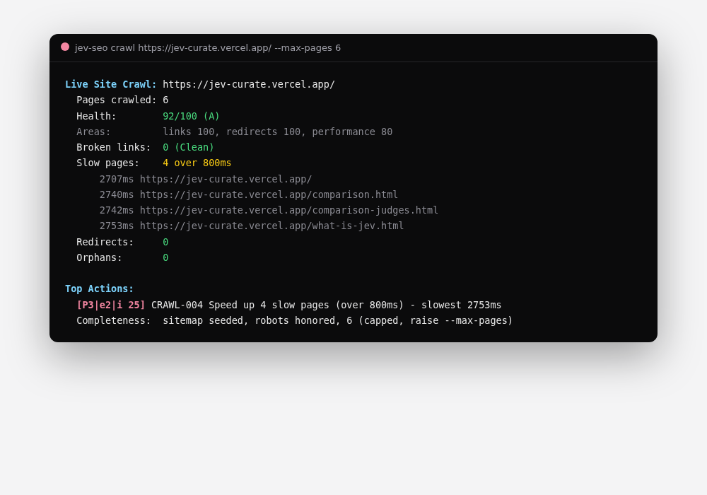
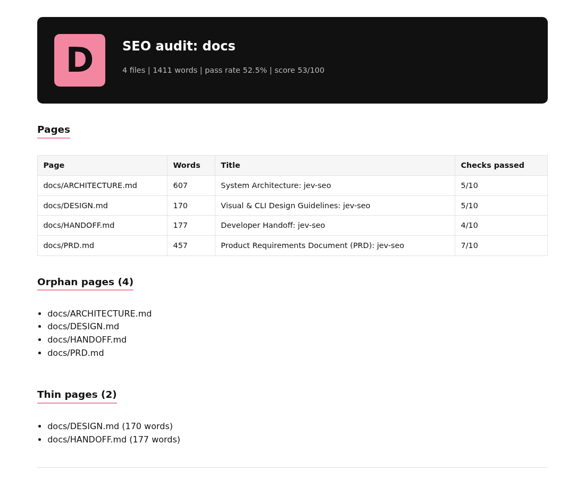
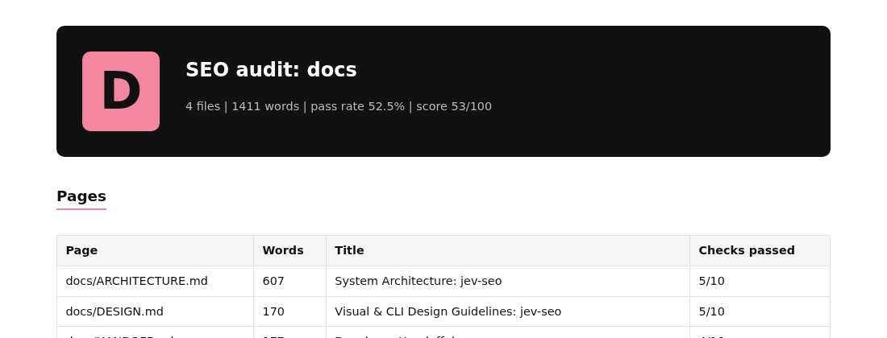

<!--
Title: jev-seo - FOSS Zero-Cost SEO & GEO Audit Suite
Description: Open-source, subscription-free alternative to Semrush and Ahrefs. Rust CLI + 13-tool MCP server powered by TypeSafe AI Jev. Audit, crawl, GEO, briefs, rank tracking. Rs0 to run.
Keywords: seo, geo, generative engine optimization, typesafe ai, jev, foss, rust, cli, mcp, semrush alternative, ahrefs alternative, free seo tool, llm seo, ai crawler
-->

<div align="center">
  <h1>jev-seo</h1>
  <p><strong>Free SEO and GEO search radar for developers and coding agents</strong></p>
  <p>
    <a href="https://github.com/AkashPriyadarshii/jev-seo/blob/master/LICENSE"></a>
    <a href="https://crates.io/crates/jev-seo"></a>
    <a href="https://crates.io/crates/jev-seo"></a>
    <a href="https://github.com/AkashPriyadarshii/jev-seo/actions/workflows/ci.yml"></a>
    <a href="https://github.com/AkashPriyadarshii/jev-seo/releases"></a>
    <a href="https://typesafe.ai"></a>
  </p>
  <p>By <strong>Akash Priyadarshi</strong></p>
  <p>
    <a href="#why-jev-seo">Why</a> •
    <a href="#quickstart">Quickstart</a> •
    <a href="#whats-new">What's new</a> •
    <a href="#workflows">Workflows</a> •
    <a href="#command-reference">Commands</a> •
    <a href="#native-mcp-server-13-tools">MCP</a> •
    <a href="#architecture">Architecture</a> •
    <a href="#ecosystem">Ecosystem</a>
  </p>
  <p>
    <a href="https://jevseo.vercel.app"></a>
    <a href="https://akashpriyadarshii.github.io/jev-seo/"></a>
    <a href="https://github.com/AkashPriyadarshii/jev-seo/stargazers"></a>
  </p>
</div>

---

## What it is

`jev-seo` is a single Rust binary that audits pages, crawls live sites, scores AI citation readiness, writes content briefs, tracks rankings, and exposes 13 tools over MCP. It scrapes DuckDuckGo for free search data. Semantic scores come from TypeSafe AI Jev as typed `Choice`, `Score`, and `Noul` judgments with confidence gates. Rules, crawls, and reports cost ₹0. No seat. No dashboard login.

```
$ jev-seo explain R19
R19 | content | Medium | effort 2 (about a day)
  title: AI slop markers
  fix:   Rewrite flagged boilerplate in plain words.
```

---

## See it run

Live crawl of a real production site with health score, ranked actions, and completeness notes:



Single-file HTML report from `audit --html`, with grade scorecard:



Grade scorecard close-up from the same report:



---

## Why jev-seo?

Semrush and Ahrefs price seats at $130+ per month. OpenSEO still asks for a DataForSEO card. Most suites ship as a browser tab full of vanity charts you cannot script, gate behind CI, or hand to an agent.

- **Zero subscriptions (₹0)**: DuckDuckGo HTML and suggest endpoints for search data. No credit card for the free path.
- **TypeSafe Jev System One**: Intent classification, competitive gaps, and GEO scores as typed primitives, not free-form chat. Confidence gates drop weak answers instead of printing them.
- **Fifty-rule engine**: R01-R50 with severity weights across nine areas. Crawl and audit read the same registry.
- **Batch directory audit**: Hundreds of Markdown/HTML files in under a second. Title collisions, thin pages, orphans, cannibalization pairs.
- **Live-site crawler**: BFS with canonical dedup, per-page timing, health score, ranked actions, optional SQLite `--diff`.
- **GEO scoring**: Five-dimension composite (structure, density, directness, statistics, freshness) with published weights and score history.
- **Answer-engine readiness**: `llms.txt` plus AI crawler permission scoring for GPTBot, ClaudeBot, PerplexityBot, Google-Extended, Bytespider.
- **SERP briefs**: Competitor titles and snippets into an H2 outline and a direct-answer block sized for answer engines.
- **2026 Schema.org validator**: JSON-LD for SoftwareApplication, Article, Organization, Product; flags deprecated types.
- **Agent native**: stdio JSON-RPC 2.0 MCP with 13 tools. One config block wires Claude Code, Gemini CLI, and Antigravity.
- **Spend controls**: `--jev-budget` hard-caps semantic spend per run. `--no-jev` forces rules-only mode for CI and offline boxes.
- **Reproducible reports**: `run.json` + `ledger.json` citation gates, optional `narrative.json`, HTML/PDF/Markdown/CSV/action-tracker exports.
- **Local and private**: Rank history and snapshots live in `.jev-seo.db` on your machine.
- **Low RAM**: Native binary; the help path cold-starts in single-digit milliseconds on the machine this README was written on.

## Free vs paid dashboards

| Job | Paid dashboards | jev-seo |
|---|---|---|
| One-site audit with ranked fixes | Monthly seat, queued crawl | `crawl` in seconds, actions free |
| Rank tracking over time | Subscription per project | SQLite drift history, ₹0 |
| AI visibility scoring | Add-on tier | `geo` + `llms`, fractions of a cent per Jev call |
| Agent access | API credits per call | 13-tool MCP on stdio |
| Report exports | Export limits per plan | HTML, PDF, Markdown, CSV, action tracker, pairs |
| CI gate | Plan tier | `audit --min-pass`, zero config beyond the binary |

---

## What's new

crates.io ships **v0.1.1**. The **v0.1.2** release is scheduled for **22 October 2026**.

Features already on `master` and included in that release:

| Feature | Use it now |
|---|---|
| `explain R19` / `RULE-R19` | Rule card: area, severity, effort, fix |
| `report --baseline` | Score delta and rules cleared/new between two audit JSONs |
| `audit --actions-csv` | Ranked action tracker (id, priority, effort, impact) |
| `audit --pairs-csv` | Cannibalization A×B pairs with word-count winner |
| `audit --manifest` | Frozen `run.json` + `ledger.json` next to exports |
| `--no-jev` / `--jev-budget` | Rules-only mode and hard USD spend cap |
| `narrative.json` | Optional owner narrative; unknown action IDs fail closed |
| MCP `seo_explain`, `seo_report` | Same explain and baseline diff over stdio (13 tools) |

**Want them before 22 Oct?** Build from source:

```bash
git clone https://github.com/AkashPriyadarshii/jev-seo.git
cd jev-seo
cargo install --path .
jev-seo explain R19
```

Or pin the commit:

```bash
git clone https://github.com/AkashPriyadarshii/jev-seo.git
cd jev-seo
git checkout master
cargo build --release
./target/release/jev-seo --version
```

After 22 Oct, plain `cargo install jev-seo` pulls v0.1.2 from crates.io.

---

## Quickstart

```bash
# Install the published crate (v0.1.1 today; v0.1.2 on 22 Oct 2026)
cargo install jev-seo

# Optional: free TypeSafe key for Jev semantic scores
export TYPESAFE_API_KEY=your_key_here

# Live SERP competitive radar
jev-seo query "offline expense tracker android"

# Audit a docs directory under 50 rules
jev-seo audit docs/

# Crawl a site, print health score and ranked actions
jev-seo crawl https://example.com --max-pages 10

# Export reports agents and spreadsheets can read
jev-seo audit docs/ --html out/report.html --actions-csv out/actions.csv --pairs-csv out/pairs.csv

# Fail CI when the pass rate drops
jev-seo audit docs/ --min-pass 40

# Wire MCP into your agent client once
jev-seo mcp
```

### Install

| Lane | Command |
|---|---|
| Cargo (published) | `cargo install jev-seo` |
| Build from source (includes What's new before release) | `git clone … && cargo install --path .` |
| Linux x86_64 / ARM64 | `jev-seo-<target>.tar.gz` from [Releases](https://github.com/AkashPriyadarshii/jev-seo/releases) |
| macOS Intel / ARM | Same Releases page, `tar.gz` with SHA256 |
| Windows x86_64 | Same Releases page, `.zip` |

Agent MCP config (one block, any MCP client):

```json
{
  "mcpServers": {
    "jev-seo": { "command": "jev-seo", "args": ["mcp"] }
  }
}
```

---

## Workflows

### 1. Batch directory and file on-page audit

```bash
jev-seo audit content/posts/
jev-seo audit content/posts/ --html report.html --pdf report.pdf --md report.md
jev-seo audit content/posts/ --actions-csv actions.csv --pairs-csv pairs.csv --manifest out/
```

Walks every Markdown and HTML file. Flags title collisions, thin content under 300 words, missing canonicals, missing alt text, skip-level headings, AI boilerplate phrases, em-dash density, orphan pages, and keyword stems that fight each other. `--pairs-csv` expands each multi-file stem into explicit A×B rows with a word-count winner so you know which URL to keep.

### 2. JSON-LD Schema.org validation

```bash
jev-seo schema content/guide.md
```

Checks required properties for SoftwareApplication, Article, Organization, and Product. Flags deprecated types such as HowTo rich results that no longer qualify.

### 3. Robots.txt and AI crawler inspection

```bash
jev-seo robots example.com
```

Reads `robots.txt` for generative AI indexers: GPTBot, ClaudeBot and anthropic-ai, PerplexityBot, Google-Extended, Bytespider. Prints allow/disallow and ranked readiness actions.

### 4. SERP-driven content brief

```bash
jev-seo brief "fast local sqlite tui" --markdown
```

Pulls live DuckDuckGo competitors, estimates word count, and runs a Jev fan-out for heading outline plus a direct-answer block sized for answer engines.

### 5. Generative Engine Optimization (GEO)

```bash
jev-seo geo README.md --query "agentic skills framework for coding agents"
```

Scores citation likelihood 1-10 with Jev `Score` and `Noul`. Prints a five-dimension composite with code-owned weights and the delta since your last run. Low-confidence answers are withheld instead of guessed.

### 6. Confidence-gated scoring

Every Jev verdict carries calibrated confidence. Strong scores print as facts. Shaky ones print `[verify]`. Unsure ones print a note and no number. Thresholds live in `src/policy.rs`. Act confidence for destructive or high-stakes paths is 0.80. Injection pre-screen runs before quality suites.

### 7. CI SEO gate

```bash
jev-seo audit docs/ --min-pass 40
jev-seo audit docs/ --no-jev --jev-budget 0
```

Nonzero exit when pass rate falls under the floor. `--no-jev` and `--jev-budget 0` keep CI free of network semantic calls. Workflow: `.github/workflows/seo-gate.yml`.

### 8. XML sitemap and hreflang auditor

```bash
jev-seo sitemap sitemap.xml
jev-seo sitemap https://example.com/sitemap.xml
```

Enforces canonical HTTPS, flags parameter pollution, checks the 50,000 URL limit, and validates international `hreflang` codes (rejects `en-UK` for `en-GB`, requires `x-default` when alternates exist).

### 9. Helpful Content and AI slop radar

Built into `jev-seo audit`:

- Em-dash density over 2 per 500 words
- 17 AI boilerplate markers (delve, leverage, testament, foster, seamless, crucial, robust, landscape, and peers)
- Heading hierarchy skip-levels (H1 to H3 with no H2)
- Internal link graph for zero-inbound orphans
- Keyword cannibalization stems, plus A×B conflict pairs

### 10. Explain a rule, then diff a baseline

```bash
jev-seo explain R19
jev-seo explain RULE-R42 --json

jev-seo audit docs/ --json > before.json
# ... fix content ...
jev-seo audit docs/ --json > after.json
jev-seo report after.json --baseline before.json
```

`explain` prints area, severity, effort band, title, and fix for any stable rule id. `report` prints score delta, rules cleared, rules new, and the ranked action list for the current file.

### 11. Optional narrative next to the report

Drop `narrative.json` beside your export (or in `--manifest` directory). Required keys: `executive_summary`, `strengths`, `risks`, `plan`. Every `RULE-Rxx` you cite must exist in that run or load fails. Numbers that match nothing in the audit and plan effort bands that fight the action table print as warnings. Missing file embeds an automatic evidence-only summary, labeled automatic. Spec: `references/narrative.md`. Example: `examples/narrative.example.json`.

---

## Command Reference

| Command | Description | Flags |
|---|---|---|
| `keywords <query>` | Autocomplete discovery and Jev intent classification | `--json` |
| `query <query>` | Live SERP scrape, Jev relevance rerank, gap analysis | `--limit <n>`, `--provider auto\|ddg\|tavily`, `--depth`, `--topic`, `--json` |
| `audit <path>` | Directory or file audit under 50 rules; orphans, thin, cannibalization | `--target-query <query>`, `--json`, `--min-pass <pct>`, `--html <path>`, `--pdf <path>`, `--md <path>`, `--csv <path>`, `--actions-csv <path>`, `--pairs-csv <path>`, `--rescore <path>`, `--manifest <dir>`, `--no-jev`, `--jev-budget <usd>` |
| `geo <target>` | GEO citation score 1-10, five-dimension composite, trend | `--query <query>`, `--json`, `--jev-budget <usd>` |
| `schema <target>` | JSON-LD structural and deprecation validator | `--json` |
| `robots <domain>` | Robots.txt and AI crawler permission auditor | `--json` |
| `brief <topic>` | SERP heading outline and direct-answer block | `--limit <n>`, `--markdown`, `--json` |
| `rank` | SQLite rank drift tracker (`.jev-seo.db`) | `--domain <domain>`, `--query <query>` |
| `sitemap <target>` | XML sitemap, 50k limit, HTTPS, hreflang | `--json` |
| `crawl <url>` | Live BFS crawl: health score, actions, redirects, orphans, timing | `--max-pages <n>`, `--fetch auto\|direct\|jina\|firecrawl`, `--max-credits <n>`, `--json`, `--diff`, `--csv <path>`, `--rescore <path>`, `--manifest <dir>`, `--no-jev`, `--jev-budget <usd>` |
| `llms <domain>` | llms.txt and AI crawler readiness with actions | `--json` |
| `explain <id>` | Rule card for `R19` or `RULE-R19` | `--json` |
| `report <path>` | Diff two audit JSONs: score, rules, actions | `--baseline <path>`, `--actions-csv <path>`, `--json` |
| `doctor` | Version, API key, database, platform | `--json` |
| `gsc <auth\|sites\|query>` | Search Console: free first-party query data | `--site <url>`, `--code`, `--limit <n>`, `--json` |
| `mcp` | Stdio JSON-RPC 2.0 agent MCP server | (None) |

Real `--help` excerpt (audit):

```
Usage: jev-seo.exe audit [OPTIONS] <PATH>

Options:
      --json
      --min-pass <MIN_PASS>       Exit nonzero when pass rate falls below this percent (CI gate)
      --html <PATH>               Write a single-file HTML report to this path
      --pdf <PATH>                Write a PDF report to this path
      --md <PATH>                 Write a Markdown report to this path
      --csv <PATH>                Write a CSV findings export to this path
      --actions-csv <PATH>        Write ranked action-tracker CSV (id, priority, effort, impact)
      --pairs-csv <PATH>          Write stem×URL conflict pairs CSV (cannibalization)
      --rescore <PATH>            Rebuild findings and actions from a saved audit JSON, no work
      --manifest <DIR>            Write run.json + ledger.json to this directory
      --no-jev                    Skip all Jev semantic calls (rules and local audit only)
      --jev-budget <USD>          Hard Jev spend cap in USD for this run [default: 0.25]
```

Optional `narrative.json` beside audit exports loads at report time: unknown action IDs fail closed; a missing file embeds an automatic evidence-only summary (`references/narrative.md`).

---

## Native MCP Server (13 Tools)

`jev-seo mcp` speaks stdio JSON-RPC 2.0. It answers `initialize`, stays silent on notifications, reports parse errors, and sets `isError` on tool failures. File tools use a guarded reader (content extensions only, no dot-files, no URLs) plus a Jev safety classifier for secret-looking targets. Remote fetches refuse private hosts, resolved DNS, and redirect landings.

| MCP Tool | Arguments | Purpose |
|---|---|---|
| `seo_keywords` | `query: string` | Autocomplete variants and intent class |
| `seo_serp_inspect` | `query: string`, `limit?: int` | Live top titles, snippets, URLs |
| `seo_audit` | `path: string` | Local Markdown/HTML audit, orphans, AI slop |
| `seo_geo` | `target: string`, `query: string` | Citation likelihood 1-10 and answer presence |
| `seo_schema` | `target: string` | JSON-LD structure and deprecation rules |
| `seo_robots` | `domain: string` | Live robots.txt for major LLM crawlers |
| `seo_brief` | `topic: string`, `limit?: int` | Markdown brief with H2 outline |
| `seo_sitemap` | `target: string` | Sitemap protocol, HTTPS, hreflang |
| `seo_crawl` | `url: string`, `max_pages?: int` | Broken links, redirects, orphans |
| `seo_llms` | `domain: string` | llms.txt and AI crawler permissions |
| `seo_extract` | `urls: string[]`, `query: string` | URL to markdown (key-gated paid path) |
| `seo_explain` | `id: string` | Rule card for `R19` / `RULE-R19` |
| `seo_report` | `path: string`, `baseline: string` | Audit JSON diff: score, rules, actions, pairs |

---

## Examples from real runs

Real output checked into the repo, not mockups:

- `examples/jevseo-site/crawl.json` — 10-page live crawl with health score, areas, findings, actions
- `examples/jevseo-site/llms.json` — answer-engine readiness with checks and actions
- `examples/local-docs/report.html`, `report.md`, `findings.csv` — one audit, three formats
- `examples/narrative.example.json` — narrative contract shape for report embeds

---

## Benchmarks

Measured 2026-09-22. Rerun any row; protocol in `docs/EVAL.md`.

| Check | Result | Rerun |
|---|---|---|
| Cold start | 6ms | `time jev-seo --help` |
| Local audit, 4 files | ~0.2s | `jev-seo audit docs/ --json` |
| Live crawl, 6-10 pages | 3-11s wall, server-bound | `jev-seo crawl <url> --max-pages 10` |
| Score repeatability, 3 runs | 99 stable, findings ±2 from timing | `jev-seo crawl <url> --json` ×3 |
| Test suite | 72 green, zero clippy warnings | `cargo test` |

Jev spend is capped per run (`--jev-budget`, default $0.25). `ledger.json` records requests and tokens when a manifest directory is set.

---

## FAQ

**What does it cost?** Nothing for rules, crawls, and reports. Semantic Jev calls cost fractions of a cent and sit under a hard per-run USD cap.

**Does it need API keys?** Not for deterministic work. Jev scoring wants `TYPESAFE_API_KEY`. Without it, those sections print local-only output. Paid search and extract backends stay parked until you pass their flags and keys.

**How is this different from a web dashboard?** It is a binary. You script it, gate CI on it, and agents call it over MCP. No seat to renew.

**What is a GEO score?** Citation likelihood 1-10 for answer engines, from a five-dimension composite with published weights in `src/policy.rs`.

**Which pages does a crawl check?** Up to `--max-pages` (default 50), seeded from `/sitemap.xml` when present, robots.txt honored.

**Can CI fail on it?** Yes. `audit --min-pass` exits nonzero under your floor. `crawl --diff` reports drift against the last SQLite snapshot.

**Do I need paid APIs?** No. Paid backends are opt-in per flag. Free DuckDuckGo paths never call them.

**When do I get explain, report, and action trackers from crates.io?** v0.1.2 on **22 October 2026**. Until then, build from source (see [What's new](#whats-new)).

**Is my data sent anywhere?** Rank history and snapshots stay in `.jev-seo.db`. Audits run on your filesystem. Only the commands you point at remote hosts make network requests.

---

## Architecture

```
jev-seo
├── src
│   ├── main.rs         CLI entrypoint and command dispatch
│   ├── engine.rs       TypeSafe Jev client, fan-out, spend counters
│   ├── policy.rs       Confidence thresholds, GEO weights, injection gate
│   ├── manifest.rs     run.json + ledger.json, citation gate, budgets
│   ├── narrative.rs    narrative.json load, ID refusal, number checks
│   ├── paths.rs        Guarded file reader, domain match, SSRF block
│   ├── serp.rs         DuckDuckGo HTML and suggest scraper
│   ├── audit.rs        Batch directory and file on-page auditor
│   ├── rules.rs        Fifty-rule registry, scoring, explain, CSV
│   ├── actions.rs      Ranked actions and action-tracker CSV
│   ├── schema.rs       JSON-LD Schema.org validator
│   ├── robots.rs       Robots.txt and AI crawler analyzer
│   ├── brief.rs        SERP-driven content brief generator
│   ├── rank.rs         Local SQLite rank drift tracker
│   ├── sitemap.rs      XML sitemap and hreflang auditor
│   ├── crawl.rs        Live-site BFS crawler with dedup and timing
│   ├── llms.rs         llms.txt and AI crawler readiness scorer
│   ├── mcp.rs          Stdio JSON-RPC 2.0 MCP server (13 tools)
│   └── tests.rs        Unit and integration harness (72 tests)
├── references/narrative.md
├── examples/           Real crawl, audit, and narrative fixtures
├── docs/               PRD, design, architecture, EVAL protocol
├── Cargo.toml
└── README.md
```

---

## Development

```bash
git clone https://github.com/AkashPriyadarshii/jev-seo.git
cd jev-seo
cargo test
cargo clippy --all-targets -- -D warnings
cargo run -- audit docs/ --min-pass 40
```

CI runs `cargo check --all-targets`, `cargo test --all`, and the SEO gate on every push to `master`.

---

## Non-Goals

- No Electron or cloud web dashboard.
- No forced DataForSEO or other paid API dependency for the free path.
- No generative prose synthesis. Jev is an evaluation oracle, not a writer.
- No AVD or heavy local browser farm. Crawls use lightweight HTTP fetches.

---

## Ecosystem

- [jev-seo](https://github.com/AkashPriyadarshii/jev-seo) — this radar (FOSS SEO and GEO CLI + MCP)
- [jev-superpowers](https://github.com/AkashPriyadarshii/jev-superpowers) — Jev-gated agent engineering workflows
- [jev-curate](https://github.com/AkashPriyadarshii/jev-curate) — Jev-curated content toolkit
- [jev-git](https://github.com/AkashPriyadarshii/jev-git) — Jev reflex gates for git
- [tdlib-android](https://github.com/AkashPriyadarshii/tdlib-android) — Precompiled TDLib binaries for four Android ABIs
- [kharcha](https://github.com/AkashPriyadarshii/kharcha) — Offline-first UPI expense tracker for Android

---

## Author

**Akash Priyadarshi**  
Patna, Bihar, India  

- GitHub: [@AkashPriyadarshii](https://github.com/AkashPriyadarshii)
- Portfolio: [akashpriyadarshi.vercel.app](https://akashpriyadarshi.vercel.app)
- LinkedIn: [Akash Priyadarshi](https://linkedin.com/in/akash-priyadarshi-1aa51b37a)
- Resume: [akashpriyadarshii.github.io/Resume](https://akashpriyadarshii.github.io/Resume/)

**Social:** [X / Twitter](https://x.com/Akash__ydv001) · [Threads](https://www.threads.net/@akash.priyadarshii) · [Instagram](https://www.instagram.com/akash.priyadarshii/) · [Reddit](https://reddit.com/user/DragonfruitWeak2801)

---

## Contributors

- [@jerryrat](https://github.com/jerryrat) — paid search provider path and DuckDuckGo header research (PR #2)

---

*Zero-cost, agent-first SEO and GEO radar. Built with TypeSafe AI System One. MIT licensed.*
